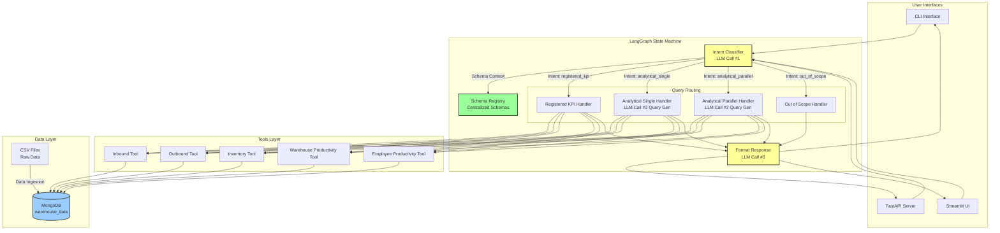
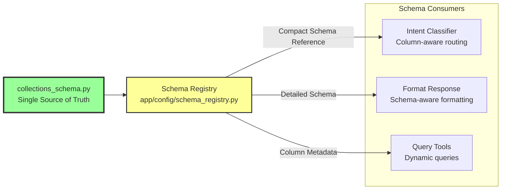
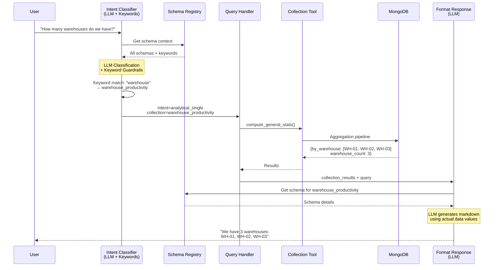
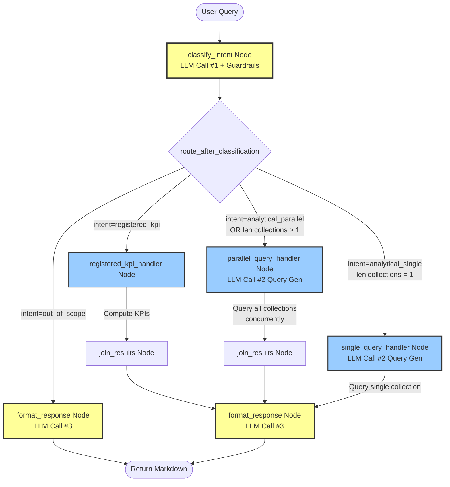
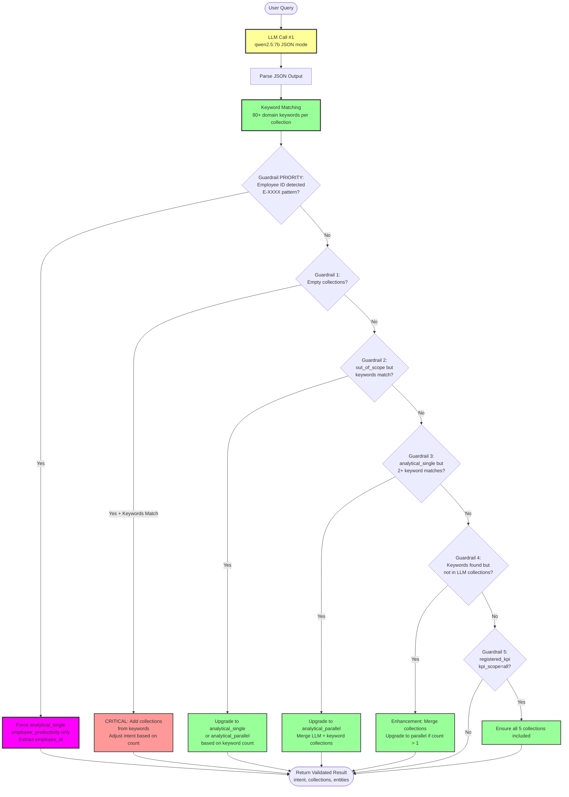

# 🏭 Warehouse KPI Agent

> **AI-powered warehouse analytics agent using LangGraph, Ollama (qwen2.5:7b), and MongoDB**

A sophisticated warehouse KPI analytics system that provides natural language querying of warehouse operations data across 5 key domains: Inbound, Outbound, Inventory, Warehouse Productivity, and Employee Productivity.

## 📋 Table of Contents

- [Overview](#overview)
- [Architecture](#architecture)
- [Query Processing Flow](#query-processing-flow)
- [Features](#features)
- [Data Collections](#data-collections)
- [KPI Registry](#kpi-registry)
- [Setup](#setup)
- [Usage](#usage)
- [API Documentation](#api-documentation)
- [Project Structure](#project-structure)

---

## 🎯 Overview

The Warehouse KPI Agent is a **schema-driven, keyword-aware** analytics system that:

- ✅ Answers natural language questions about warehouse operations
- ✅ Computes 16+ registered KPIs across 5 collections
- ✅ Provides analytical queries with intelligent routing
- ✅ Exports KPI reports to Excel
- ✅ Offers both CLI, API (FastAPI), and UI (Streamlit) interfaces
- ✅ Uses **zero hardcoded logic** - all routing is schema and keyword-driven

### Key Capabilities

```
"How many warehouses do we have?"              → Analytical Single
"Fill rate for WH-02 from Dec to Jan"         → Registered KPI
"Show me all KPIs for WH-01"                   → Registered KPI (All Collections)
"Supplier delays and stockout levels"         → Analytical Parallel (Multi-collection)
"Employee E-1033 performance last month"      → Analytical Single (Employee-specific)
```

---

## 🏗️ Architecture

### System Architecture Diagram



### Schema-Driven Design



**Key Principle**: All column names, types, metrics, and relationships defined in ONE place (`collections_schema.py`), consumed everywhere.

---

## 🔄 Query Processing Flow

### Complete Query Flow



### Complete LangGraph Node Flow



**Node Descriptions:**

| Node | Purpose | Output |
|------|---------|--------|
| **classify_intent** | LLM Call #1: Classifies query intent, extracts entities, applies 6-level keyword guardrails (includes priority employee detection) | `classified_intent`, `target_collections`, `entities_extracted`, `query_params` |
| **route_after_classification** | Conditional edge: Routes to appropriate handler based on intent and collection count | Determines next node |
| **registered_kpi_handler** | Computes specific or all KPIs using formulas from kpi_registry.py | `collection_results` (multi-collection) |
| **single_query_handler** | Queries exactly one collection for analytical data. LLM Call #2 (optional): Uses LLM to generate MongoDB aggregation pipeline from natural language | `collection_results` (single collection) |
| **parallel_query_handler** | Queries multiple collections concurrently using asyncio. LLM Call #2 (optional): Uses LLM to generate MongoDB pipelines | `collection_results` (multi-collection) |
| **join_results** | Aggregates results from multiple collections into unified structure | `db_results`, `result_count` |
| **format_response** | LLM Call #3: Formats results as markdown using schema context | `formatted_response` (markdown string) |

**Routing Logic:**

```python
def route_after_classification(state: AgentState) -> str:
    intent = state.get("classified_intent", "out_of_scope")
    target_collections = state.get("target_collections") or []

    if intent == "out_of_scope":
        return "format_response"  # Skip DB queries
    
    if intent == "registered_kpi":
        return "registered_kpi"  # Always use KPI handler
    
    if intent == "analytical_parallel":
        return "parallel_query"  # Multi-collection
    
    if len(target_collections) > 1:
        return "parallel_query"  # Multi-collection even if intent is single
    
    return "single_query"  # Single collection
```

### Intent Classifier Internal Logic (6-Level Guardrail System)



### 6-Level Keyword Guardrail System

```python
# Guardrail PRIORITY: Specific employee ID detection (highest priority)
employee_id_match = re.search(r'\bE-\d{4}\b', query, re.IGNORECASE)
if employee_id_match:
    employee_id = employee_id_match.group(0).upper()
    logger.info(
        "Guardrail PRIORITY: Specific employee query detected (%s) → analytical_single on employee_productivity",
        employee_id
    )
    if intent not in ("registered_kpi",):  # Don't override registered_kpi
        intent = "analytical_single"
        target_collections = ["employee_productivity"]
        entities["employee_id"] = employee_id

# Guardrail 1: CRITICAL - Empty collections (prevents default fallback)
elif not target_collections and keyword_matched_collections:
    logger.info("Guardrail CRITICAL: empty collections → %s via keywords", keyword_matched_collections)
    target_collections = keyword_matched_collections
    # Adjust intent based on number of matched collections
    if len(keyword_matched_collections) == 1:
        if intent not in ("registered_kpi",):
            intent = "analytical_single"
    elif len(keyword_matched_collections) > 1:
        if intent not in ("registered_kpi",):
            intent = "analytical_parallel"

# Guardrail 2: out_of_scope but keywords matched collections
elif intent == "out_of_scope" and keyword_matched_collections:
    logger.info("Guardrail upgrade: out_of_scope → analytical_%s", 
                "parallel" if len(keyword_matched_collections) > 1 else "single")
    if len(keyword_matched_collections) == 1:
        intent = "analytical_single"
    else:
        intent = "analytical_parallel"
    target_collections = keyword_matched_collections

# Guardrail 3: analytical_single but keywords indicate multiple collections
elif intent == "analytical_single" and len(keyword_matched_collections) >= 2:
    logger.info("Guardrail upgrade: analytical_single → analytical_parallel")
    intent = "analytical_parallel"
    # Merge LLM-detected and keyword-detected collections
    target_collections = list(dict.fromkeys(target_collections + keyword_matched_collections))

# Guardrail 4: Enhancement - merge keyword-detected with LLM-detected
elif intent in ("analytical_single", "analytical_parallel") and keyword_matched_collections:
    merged = list(dict.fromkeys(target_collections + keyword_matched_collections))
    if len(merged) > len(target_collections):
        logger.info("Guardrail enhancement: added collections %s via keywords",
                    [c for c in merged if c not in target_collections])
        target_collections = merged
        # Upgrade to parallel if now multiple collections
        if len(target_collections) > 1 and intent == "analytical_single":
            intent = "analytical_parallel"

# Guardrail 5: registered_kpi with kpi_scope="all" should always have all collections
if intent == "registered_kpi" and kpi_scope in ("all", None, "null", ""):
    if set(target_collections) != set(ALL_COLLECTIONS):
        logger.info("Guardrail: registered_kpi kpi_scope=all → adding all collections")
        target_collections = list(ALL_COLLECTIONS)
```

---

## ✨ Features

### 1. Schema-Driven Architecture

- **Single Source of Truth**: All schemas in `collections_schema.py`
- **No Hardcoded Logic**: Routing based on schemas and keywords
- **Self-Documenting**: LLM sees actual schema context

### 2. Intelligent Intent Classification

- **4 Intent Types**:
  - `registered_kpi` - Compute specific or all KPIs
  - `analytical_single` - Query one collection
  - `analytical_parallel` - Query multiple collections
  - `out_of_scope` - Non-warehouse questions

- **6-Level Keyword Guardrail System**: 
  - **Priority**: Employee ID detection (E-XXXX pattern)
  - **Critical**: Empty collections correction
  - **Upgrade**: out_of_scope → analytical query
  - **Multi-detect**: Single → parallel for multi-domain
  - **Enhancement**: Merge LLM + keyword collections
  - **KPI-All**: Ensure all collections for scope=all
  - 80+ domain-specific keywords per collection
  - Automatic routing correction if LLM misclassifies
  - Column-aware routing

### 3. Natural Language Flexibility

```python
# Same question, different phrasings - all work
"How many warehouses do we have?"
"Count of warehouses"
"How many WH do we have"
"warehouse count"
"List all warehouses"
```

### 4. Multi-Collection Queries

```python
# Automatically detects multiple domains
"Show me supplier delays and stockout levels"
→ Routes to: inbound_parts + inventory_snapshot

"Employee performance and outbound fill rate"
→ Routes to: employee_productivity + outbound_parts
```

### 5. Multi-Format Export System

All registered KPI queries automatically generate three output formats:

**Excel Report** (`kpi_report.xlsx`):
- Multi-sheet workbook
- First sheet: "Key KPIs" (5 critical metrics)
- Additional sheets: One per collection (Inbound, Outbound, Inventory, Warehouse, Employee)
- Columns: KPI | Current | Target | Delta | Status | Comment
- Conditional formatting for status (GREEN/YELLOW/RED)

**JSON Report** (`kpi_report.json`):
- Structured data format
- Header: period, warehouses, status
- Summary cards: Array of KPI objects with value, target, delta, status

**HTML One-Pager** (`kpi_onepager.html`):
- Leadership summary report
- Embedded CSS styling
- KPI cards with visual status indicators
- Tables grouped by collection
- Self-contained (no external dependencies)

All three files saved to: `output/<timestamp>/`
- Example: `output/20260413_180926/kpi_report.xlsx`

---

## 📊 Data Collections

### Collection Overview

| Collection | Grain | Records | Key Metrics |
|------------|-------|---------|-------------|
| **inbound_parts** | One per PO | 3,000 | Lead time, On-time %, Discrepancy % |
| **outbound_parts** | One per Order | 3,000 | Fill rate, OTIF, Backorder rate |
| **inventory_snapshot** | One per SKU/WH/Date | 3,000 | Days of supply, Stockout % |
| **warehouse_productivity** |One per WH/Date/Shift | 3,000 | Lines/hr, Orders/day, SLA % |
| **employee_productivity** | One per Employee/Date | 3,000 | Picks/hr, Error %, Overtime % |

### Schema Example: `warehouse_productivity`

```python
{
    "columns": {
        "warehouse_id": "WH-01, WH-02, WH-03",
        "date": "datetime",
        "shift": "Day, Night",
        "lines_picked": "integer",
        "orders_processed": "integer",
        "labor_hours": "float",
        "sla_adherence_pct": "float (0.0-1.0)"
    },
    "business_metrics": {
        "lines_per_labor_hour": "sum(lines_picked) / sum(labor_hours)",
        "orders_per_day": "sum(orders_processed) / days"
    }
}
```

---

## 📈 KPI Registry

### 16 Registered KPIs

#### Inbound (4 KPIs)
- `avg_inbound_lead_time` - Average days between expected and received dates
- `on_time_receipts_pct` - % of receipts on time
- `qty_discrepancy_pct` - % quantity discrepancies
- `top_delaying_suppliers` - Top 5 suppliers by delay

#### Outbound (4 KPIs)
- `fill_rate` - Shipped qty / Ordered qty
- `otif` - On-Time In-Full percentage
- `backorder_rate` - Backorder qty / Ordered qty
- `top_backorder_skus` - Top 10 SKUs by backorder

#### Inventory (2 KPIs)
- `days_of_supply` - On-hand / Average daily demand
- `stockout_pct` - % of days with stockouts

#### Warehouse Productivity (3 KPIs)
- `lines_per_labor_hour` - Lines picked / Labor hours
- `orders_per_day` - Total orders processed daily
- `sla_adherence` - % orders meeting SLA

#### Employee Productivity (3 KPIs)
- `picks_per_hour` - Picks / Hours worked
- `error_rate` - Errors / Tasks completed
- `overtime_pct` - Overtime hours / Total hours

---

## 🚀 Setup

### Prerequisites

- Python 3.12+
- MongoDB 7.0+
- Ollama with qwen2.5:7b model
- Docker (for MongoDB, optional)

### Installation

```bash
# 1. Clone the repository
git clone -b dev 
cd Warehouse-AI/warehouse_kpi_agent

# 2. Create virtual environment
python3 -m venv venv
source venv/bin/activate  # On macOS/Linux
# venv\Scripts\activate   # On Windows

# 3. Install dependencies
pip install -r requirements.txt

# 4. Create .env file
cat > .env << EOF
MONGODB_URI=mongodb://localhost:27017
MONGODB_DB=warehouse_data
OLLAMA_BASE_URL=http://localhost:11434
LLM_MODEL=qwen2.5:7b
LOG_LEVEL=INFO
EOF

# 5. Start MongoDB (using Docker)
make backend

# 6. Load data into MongoDB
make load-data

# 7. Verify Ollama is running with qwen2.5:7b
ollama list
# If not installed:
ollama pull qwen2.5:7b
```

### Makefile Commands

```bash
make help           # Show all available commands
make backend        # Start MongoDB via Docker
make load-data      # Load CSV data into MongoDB
make api            # Start FastAPI server (port 8000)
make ui             # Start Streamlit UI (port 8501)
make run            # Start CLI agent
make test           # Run test suite (16 tests)
make clean          # Remove venv and cache
make backend-stop   # Stop MongoDB container
```

---

## 💡 Usage

### CLI Interface

```bash
make run

# Examples:
> How many warehouses do we have?
> Fill rate for WH-02 from December 2024 to January 2025
> Show me all KPIs for warehouse WH-01
> What is the error rate for employee E-1033?
> Supplier delays and stockout analysis
```

### API (FastAPI)

```bash
make api
# Server runs on http://localhost:8000

# API Endpoints:
GET  /kpis                    # List all registered KPIs
POST /query                   # Query with natural language
POST /data/sync               # Reload data from CSV
GET  /docs                    # Swagger documentation
GET  /redoc                   # ReDoc documentation
```

### Example API Request

```bash
curl -X POST "http://localhost:8000/query" \
  -H "Content-Type: application/json" \
  -d '{
    "query": "Fill rate for WH-02 in December 2024",
    "stream": false
  }'
```

### Streamlit UI

```bash
make ui
# UI runs on http://localhost:8501
```

Features:
- Natural language query input
- KPI selection dropdowns
- Date range filters
- Warehouse selection
- Excel export button
- Real-time query execution
- Formatted markdown results

---

## 📡 API Documentation

### POST `/query`

Query the warehouse KPI system with natural language.

**Request Body:**
```json
{
  "query": "string",
  "stream":false
}
```

**Response:**
```json
{
  "query": "How many warehouses do we have?",
  "intent": "analytical_single",
  "collections": ["warehouse_productivity"],
  "formatted_response": "We have **3 warehouses**: WH-01, WH-02, WH-03...",
  "result_count": 1,
  "execution_path": ["classify_intent", "query_warehouse_productivity", "format_response"],
  "timestamp": "2026-04-12T10:30:00Z"
}
```

### GET `/kpis`

List all 16 registered KPIs with metadata.

**Response:**
```json
{
  "kpis": {
    "fill_rate": {
      "area": "outbound",
      "name": "Fill Rate %",
      "description": "Shipped quantity divided by ordered quantity",
      "formula": "SUM(qty_shipped) / SUM(qty_ordered)",
      "tables": ["outbound_parts"],
      "type": "metric"
    },
    ...
  }
}
```

### POST `/data/sync`

Reload data from CSV files into MongoDB.

**Response:**
```json
{
  "message": "Data sync complete",
  "collections": {
    "inbound_parts": 3000,
    "outbound_parts": 3000,
    ...
  }
}
```

---

## 📁 Project Structure

```
warehouse_AI/
├── collections_schema.py           # Single source of truth for all schemas
├── kpi_registry.py                 # All 16 registered KPIs
├── output/                         # Export outputs (Excel/JSON/HTML)
│   └── <timestamp>/                # Timestamped folders for each export
│
└── warehouse_kpi_agent/
    ├── .env                        # Configuration (local, not in git)
    ├── Makefile                    # macOS/Linux commands
    ├── requirements.txt            # Python dependencies
    ├── SCHEMA_ARCHITECTURE.md      # Detailed architecture docs
    │
    ├── app/
    │   ├── main.py                 # CLI entry point
    │   ├── server.py               # FastAPI server
    │   ├── streamlit_app.py        # Streamlit UI
    │   │
    │   ├── config/
    │   │   ├── settings.py         # Environment config
    │   │   └── schema_registry.py  # Schema access layer
    │   │
    │   ├── db/
    │   │   └── data_loader.py      # CSV → MongoDB loader
    │   │
    │   ├── graph/
    │   │   ├── graph_builder.py    # LangGraph state machine
    │   │   ├── state.py            # Graph state definition
    │   │   ├── conditions.py       # Routing logic
    │   │   │
    │   │   └── nodes/
    │   │       ├── intent_classifier.py      # LLM Call #1 + Guardrails
    │   │       ├── registered_kpi.py         # KPI computation
    │   │       ├── single_query_handler.py   # Single-collection analytics
    │   │       ├── analytical_parallel.py    # Multi-collection analytics
    │   │       ├── join_results.py           # Multi-collection result aggregation
    │   │       ├── format_response.py        # LLM Call #3 - Response formatting
    │   │       └── query_tools.py            # Tool dispatch layer
    │   │
    │   ├── services/
    │   │   ├── intent_classifier.py          # Intent classification service
    │   │   └── excel_exporter.py             # Excel/JSON/HTML triple export
    │   │
    │   └── tools/
    │       ├── base.py                       # Shared MongoDB utilities
    │       ├── inbound_tool.py               # Inbound queries
    │       ├── outbound_tool.py              # Outbound queries
    │       ├── inventory_tool.py             # Inventory queries
    │       ├── warehouse_productivity_tool.py # Warehouse queries
    │       ├── employee_productivity_tool.py  # Employee queries
    │       └── llm_query_generator.py        # LLM Call #2 - MongoDB query generation
    │
    ├── data_ingestion/
    │   ├── pipeline.py             # Data ingestion logic
    │   ├── raw_data/               # Original CSV files
    │   └── pruned/                 # Cleaned CSV files
    │
    └── tests/
        ├── run_tests.py                    # Test runner
        ├── test_intent_classification.py   # Intent routing tests (5 tests)
        ├── test_kpi_calculations.py        # KPI computation tests (5 tests)
        └── test_graph_flow.py              # End-to-end flow tests (6 tests)
```

---

## 🎨 Key Design Patterns

### 1. Schema Registry Pattern

```python
# Centralized schema access
from app.config.schema_registry import get_schema, get_columns

schema = get_schema("warehouse_productivity")
columns = get_columns("warehouse_productivity")
# → ['warehouse_id', 'date', 'shift', 'lines_picked', ...]
```

### 2. Keyword-Based Routing

```python
DOMAIN_KEYWORDS = {
    "warehouse_productivity": [
        "warehouse", "warehouses", "shift", "labor", "sla",
        "lines picked", "orders processed", ...
    ],
    "employee_productivity": [
        "employee", "employees", "worker", "picks",
        "error rate", "overtime", ...
    ]
}

# Query: "how many warehouses"
# → Matches "warehouse" keyword
# → Routes to warehouse_productivity collection
```

### 3. Three-Stage LLM Pipeline

```python
# Stage 1: Intent Classification (LLM Call #1)
intent_result = intent_classifier.classify(query)
# → {intent: "analytical_single", collections: ["warehouse_productivity"]}

# Stage 2 (Optional): Query Generation (LLM Call #2)
# For analytical queries, LLM generates MongoDB aggregation pipeline
if intent in ("analytical_single", "analytical_parallel"):
    pipeline = llm_query_generator.generate(query, schema)
    # → MongoDB aggregation pipeline JSON

# Stage 3: Response Formatting (LLM Call #3)
markdown = format_response(query, data, schema_context)
# → Formatted markdown with actual data values
```

---

## 🔧 Configuration

### Environment Variables (.env)

```bash
# MongoDB
MONGODB_URI=mongodb://localhost:27017
MONGODB_DB=warehouse_data

# Ollama
OLLAMA_BASE_URL=http://localhost:11434
LLM_MODEL=qwen2.5:7b

# Logging
LOG_LEVEL=INFO  # DEBUG, INFO, WARNING, ERROR
```

### MongoDB Collections

All data stored in `warehouse_data` database:
- `inbound_parts` (3,000 docs)
- `outbound_parts` (3,000 docs)
- `inventory_snapshot` (3,000 docs)
- `warehouse_productivity` (3,000 docs)
- `employee_productivity` (3,000 docs)

---

## 🧪 Testing

### Test Suite

The project includes comprehensive tests for core functionality:

```bash
# Run all tests
make test

# Run specific test category
python tests/run_tests.py intent        # Intent classification tests
python tests/run_tests.py kpi           # KPI calculation tests  
python tests/run_tests.py graph         # End-to-end graph flow tests

# Run individual test file
python tests/test_intent_classification.py
python tests/test_kpi_calculations.py
python tests/test_graph_flow.py
```

**Test Coverage** (16 tests total):

| Test File | Tests | Purpose |
|-----------|-------|---------|
| `test_intent_classification.py` | 5 | Intent routing, collection detection, entity extraction |
| `test_kpi_calculations.py` | 5 | KPI computation accuracy, data structure validation |
| `test_graph_flow.py` | 6 | End-to-end query processing, LLM integration |

**Example Test Output**:
```
✅ Intent Classification Tests: ALL 5 PASSED
✅ KPI Calculation Tests: ALL 5 PASSED  
✅ Graph Flow Tests: ALL 6 PASSED

Total: 16/16 tests passed
```

### Manual Testing

```bash
# Test individual tool functions
python -c "
from app.tools.warehouse_productivity_tool import compute_general_stats
result = compute_general_stats()
print(f'Warehouse count: {result.get(\"warehouse_count\")}')
"

# Test MongoDB connection
python -c "
from pymongo import MongoClient
client = MongoClient('mongodb://localhost:27017/')
db = client['warehouse_data']
print(f'Collections: {db.list_collection_names()}')
"

# Test Ollama LLM
ollama run qwen2.5:7b "Hello, are you working?"
```

---

## 🤝 Contributing

This project follows a schema-driven architecture. When adding new features:

1. **Add schemas first** in `collections_schema.py`
2. **Update schema registry** if needed
3. **Add domain keywords** to intent classifier
4. **Create/update tools** in `app/tools/`
5. **Test with natural language** queries
6. **No hardcoded routing** - use schemas and keywords

---

## 📝 License

[Add your license here]

---

## 👥 Authors

- **Sakshi** - [GitHub]

---

## 🙏 Acknowledgments

- **LangGraph** - State machine framework
- **Ollama** - Local LLM inference
- **qwen2.5:7b** - Language model
- **MongoDB** - Document database
- **FastAPI** - Web framework
- **Streamlit** - UI framework

---

## 📚 Additional Documentation

- [SCHEMA_ARCHITECTURE.md](warehouse_kpi_agent/SCHEMA_ARCHITECTURE.md) - Detailed architecture documentation
- [collections_schema.py](collections_schema.py) - Complete schema definitions
- [kpi_registry.py](kpi_registry.py) - All KPI formulas and metadata

---
